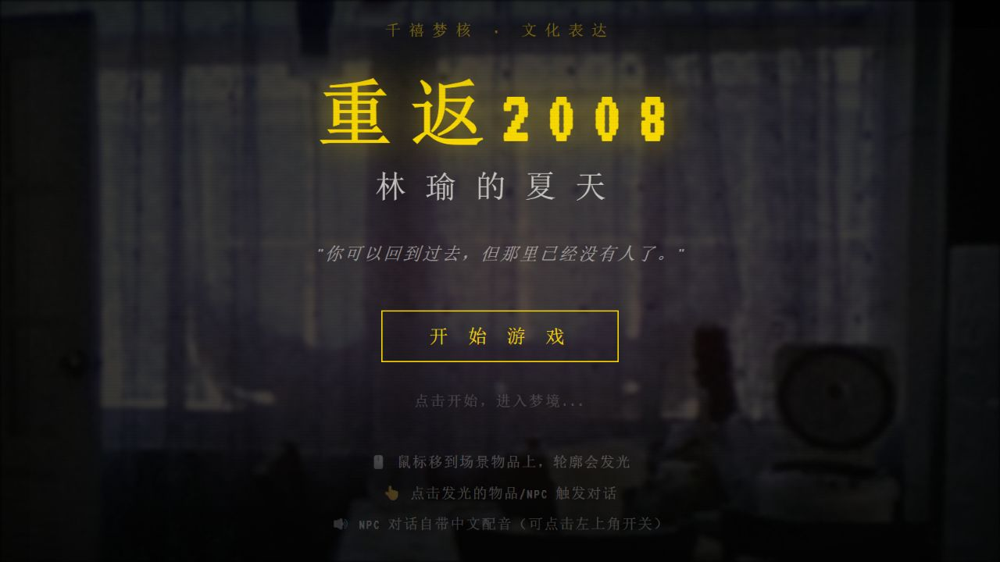
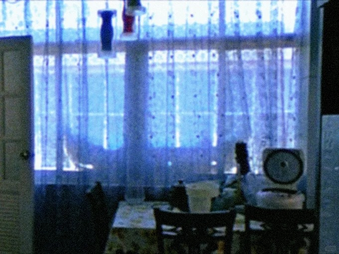
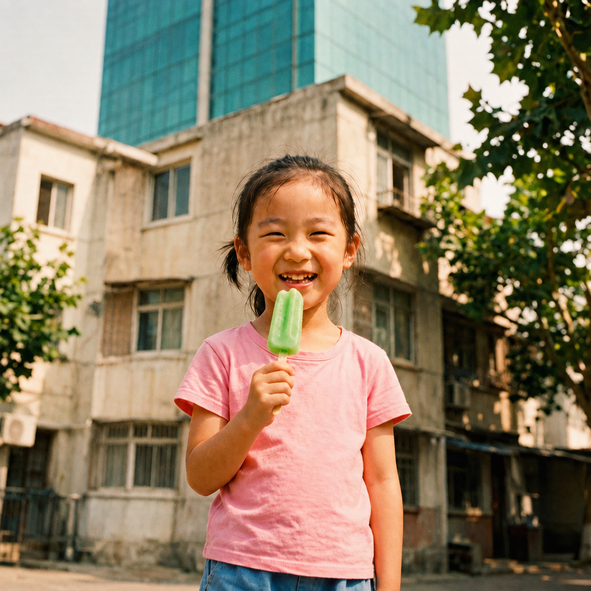
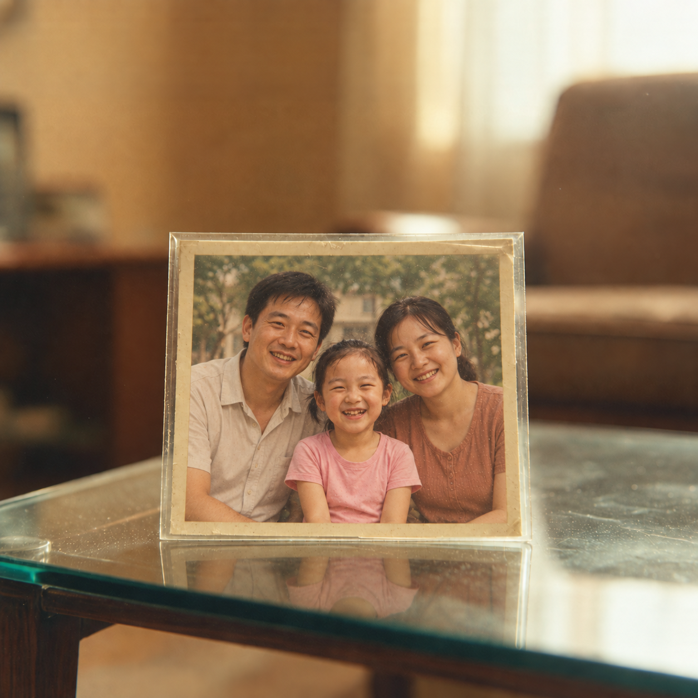
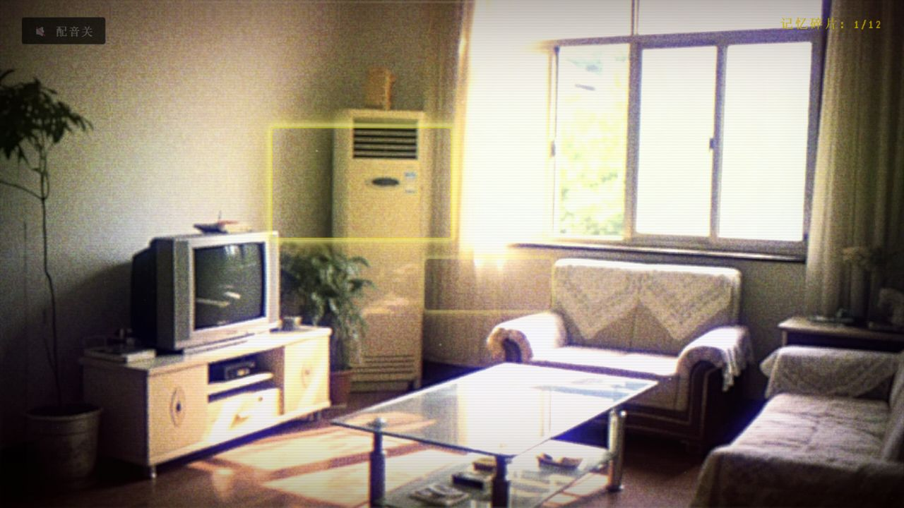
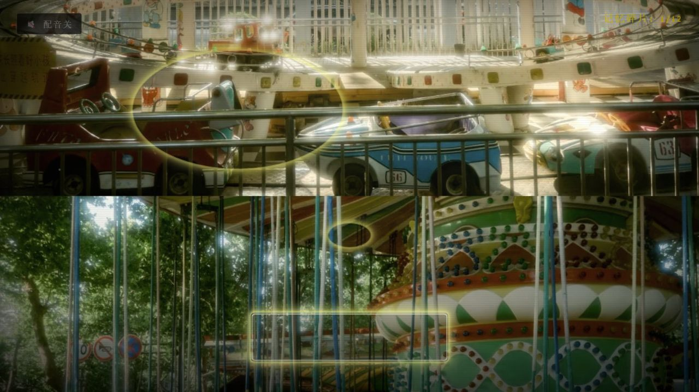

# 重返 2008：梦境碎片

### 林瑜的夏天

你可以回到过去，但那里已经没有人了。

面向 [2026 腾讯游戏创作大赛](https://gameinstitute.qq.com/awards2026/ownAward)的参赛作品。一款以中式梦核、千禧年代生活记忆与成长和解为主题的网页叙事游戏：在旧卧室、客厅、街道和游乐场之间探索，点击物品、与熟悉的人交谈，拾起散落在 2008 年夏天的记忆。



项目类型：单人网页叙事探索游戏　｜　主要操作：鼠标点击　｜　实现方式：原生网页技术

## 故事从哪里开始

2026 年，26 岁的林瑜在上海工作。一次醒来，她发现自己回到了童年卧室：天花板上的裂纹、蓝色玻璃窗、竹凉席和只写了一页的暑假作业，都停在那个漫长的夏天。

童年卧室的场景图：蓝色窗帘、旧风扇和午后的光，把故事带回 2008 年。



走出房门，楼下的周小萌还在喊她出去玩。小卖部、学校的铁门、蔷薇花墙和空转的游乐场依次出现。熟悉的人仿佛从未离开，却又与记忆中的模样隔着一层薄雾。

玩家跟随林瑜重新触碰这些日常物件，在对话与探索中理解过去，最后回到现在。

林瑜的人物设定图，让两个年龄的她在同一页相遇。

<table>
  <tr>
    <td width="50%"></td>
    <td width="50%"></td>
  </tr>
  <tr>
    <td>2008 年，8 岁的林瑜</td>
    <td>2026 年，26 岁的林瑜</td>
  </tr>
</table>

## 作品特色

- 以日常物件承载叙事：旧电视、全家福、玻璃弹珠和妈妈留下的字条构成探索线索。
- 五段连续场景：从童年卧室出发，经过客厅、街道与游乐场，回到 2026 年。
- 六组角色对话树：包含妈妈、周小萌、王奶奶、陈叔、李老师和神秘男孩，支持分支选项与重复拜访状态。
- 记忆收集与分档结局：配置共 12 个记忆条目，结局文案根据已收集数量分为三档。
- 梦核视听表现：预制场景图、暖色偏移、扫描线、噪点、暗角和故障过渡，共同营造旧影像般的体验。
- 浏览器语音与环境声：角色对白使用浏览器语音合成，场景搭配本地环境音和音效。

一张全家福、一张留在桌上的字条，都能成为重新理解过去的线索。下面是项目中的物件设定图。

<table>
  <tr>
    <td width="50%"></td>
    <td width="50%"></td>
  </tr>
  <tr>
    <td>留在相框里的全家福</td>
    <td>留在桌上的字条</td>
  </tr>
</table>

当前版本的角色对白来自预写对话树；语音由浏览器提供。运行游戏不需要配置云服务密钥、模型接口或数据库。

## 实际游戏画面

以下图片截取自仓库中的可运行版本。

熟悉的客厅



游乐场的幻梦



## 如何开始

游戏没有构建步骤，不需要安装前端依赖。准备 Python 3 和浏览器即可启动本地静态服务器：

```bash
git clone https://github.com/langezhang/Return-To-2008.git
cd Return-To-2008
python -m http.server 8000 --bind 127.0.0.1
```

保持命令窗口运行，在浏览器中打开：[http://127.0.0.1:8000/game/](http://127.0.0.1:8000/game/)。

Windows 上如果 `python` 命令不可用，可将最后一行改为：

```powershell
py -m http.server 8000 --bind 127.0.0.1
```

如果端口被占用，将命令与访问地址中的 `8000` 一起换成其他可用端口。结束体验后，在命令窗口按 `Ctrl+C` 停止服务器。

请从仓库根目录启动服务器。`game/` 与 `音频/` 必须保持同级；只单独打开或托管 `game/` 文件夹，会使本地音频路径失效。

## 操作方式

| 操作 | 效果 |
| --- | --- |
| 点击“开始游戏” | 进入序章 |
| 鼠标移动到可交互区域 | 显示热点高亮 |
| 点击物品或角色 | 阅读独白、触发对话或收集记忆 |
| 点击对话框、按回车或空格 | 显示完整文字或推进普通对话 |
| 点击对话选项 | 选择角色回应 |
| 按 `Esc` | 关闭当前对话显示 |
| 点击场景出口 | 前往下一章节 |
| 点击左上角配音按钮 | 开关对白语音 |
| 点击结局页“再次入梦” | 清空本轮进度并重新开始 |

左上角按钮控制对白配音，环境声与背景音独立播放。当前没有存档功能，刷新页面会重置本轮进度。建议先在桌面浏览器中体验，尤其是需要精确点击的场景热点。

## 章节一览

| 章节 | 场景 | 叙事主题 |
| --- | --- | --- |
| 序章：苏醒与错位 | 2008 年的卧室 | 察觉现实与记忆的错位 |
| 第一章：熟悉的陌生房间 | 家里的客厅 | 重新看见日常生活的细节 |
| 第二章：永远走不出的街道 | 小区、小卖部与学校附近 | 与童年的人和约定重逢 |
| 第三章：游乐场的幻梦 | 安静的游乐场 | 面对时间、缺席与遗憾 |
| 终章：回归与释怀 | 2026 年的卧室 | 将记忆带回当下 |

<details>
<summary>查看结局触发规则</summary>

结局依据本轮记忆收集数量选择文案，并沿用同一条主线章节顺序：

| 已收集数量 | 结局 |
| --- | --- |
| 8 个及以上 | 记忆已归档 |
| 4～7 个 | 半梦半醒 |
| 少于 4 个 | 匆匆一梦 |

物品交互与部分 NPC 对话终点都能产生记忆。配置中的 12 个条目由 8 个场景物品条目和 4 个对话条目组成。当前仍存在局部热点覆盖问题，详见[运行检查](docs/运行检查.md)。

</details>

## 技术实现

| 模块 | 作用 |
| --- | --- |
| `game/index.html` | 游戏页面、界面容器与脚本入口 |
| `game/js/config.js` | 章节、物品、场景对白和背景图配置 |
| `game/js/hotspots.js` | 场景交互区域的百分比坐标 |
| `game/js/scenes.js` | 背景切换、热点创建与物品交互 |
| `game/js/dialogues.js` | 六组 NPC 对话树的数据 |
| `game/js/dialogue-system.js` | 对话分支、拜访次数与对话记忆奖励 |
| `game/js/effects.js` | 打字机文字、界面提示与视觉过渡 |
| `game/js/audio.js` | 本地音频播放及合成备用音效 |
| `game/js/voice-system.js` | 浏览器中文语音选择与分句朗读 |
| `game/js/game.js` | 游戏状态、章节顺序、重开与结局选择 |

页面使用 HTML、CSS 和 JavaScript 实现。场景原画通过背景图加载，并保留 CSS 场景作为备用渲染；音频使用浏览器音频能力，对白朗读使用 `speechSynthesis`。

中文配音效果取决于浏览器和操作系统安装的音色。页面通过 Google Fonts 请求装饰字体，网络不可用时使用 CSS 中配置的备用字体。除浏览器提供的语音服务及外部字体外，游戏的场景图、对白和 WAV 音频均随仓库提供。

## 目录结构

```text
Return-To-2008/
├── README.md
├── game/
│   ├── index.html          # 游戏入口
│   ├── css/                # 界面、梦核效果与备用场景样式
│   ├── js/                 # 游戏逻辑及配置
│   └── images/             # 场景图与现有角色、物品图像
├── 音频/                   # 游戏引用的 WAV 文件
└── docs/
    ├── screenshots/        # 实际运行截图
    ├── illustrations/      # README 使用的设定图修复版
    ├── design/             # 剧本与人物设定，含剧情内容
    ├── 运行检查.md
    ├── 素材与整理说明.md
    └── source-manifest.json
```

设计资料：[完整剧本](docs/design/剧本_完整故事.md) · [林瑜的人物设定](docs/design/角色设定_林瑜.md) · [NPC 设定](docs/design/角色设定_NPC.md)。这些文档保留创作阶段的设定，具体已实现功能以游戏代码与当前运行画面为准。

## 当前状态

仓库提供可从标题页进入并推进章节的参赛作品版本。发布整理保留原有游戏逻辑，补齐运行素材、中文文档和实机截图。运行检查的覆盖范围与已知问题记录在[运行检查](docs/运行检查.md)中。

实测发现两处原有问题：序章的暑假作业热点被书桌覆盖；第二章街道背景因样式定位冲突移出了可见区域。本次整理记录了原因，尚未修改对应代码。

目前尚未实现持久化存档、在线多人功能或完整好感度系统；对话代码中的好感度分支仅保留扩展位置。移动端体验、全部对话路线与全收集流程尚未完成系统验证。

## 素材与使用说明

本仓库保留作品展示所需的代码、文本、场景图和音频，未附统一开源许可证。不同类型素材的使用范围以各自授权为准。原始参考素材库、未使用的音乐文件、开发工具配置和重复大图不随仓库发布。详见[素材与整理说明](docs/素材与整理说明.md)。
