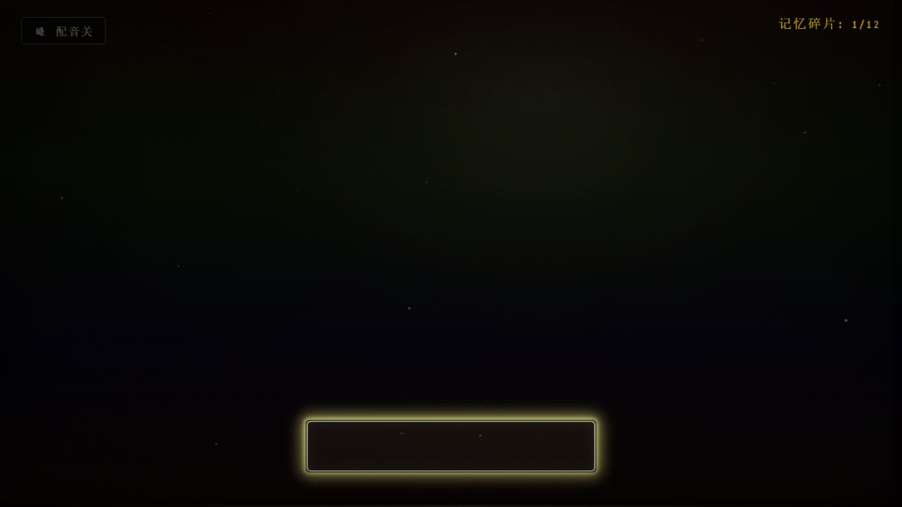

# 运行检查

本记录用于说明公开整理版的验证范围。整理工作没有修改原游戏的玩法、剧情、交互逻辑或结局条件。

## 静态核对

- 运行文件与原项目逐字节一致，摘要见 [source-manifest.json](source-manifest.json)。
- 五个章节共配置 33 个场景交互对象，每个对象均有对应热点坐标。
- 六组角色对话树共包含 87 个对话节点，配置中的跳转目标均存在。
- 记忆条目由 8 个场景物品与 4 个对话终点组成，共 12 个。
- 音频加载器引用的十份 WAV 文件已与游戏一起收录。
- 11 份 JavaScript 文件通过语法检查；44 份运行文件均可通过本地 HTTP 服务访问；十份 WAV 文件头有效。

## 浏览器实测

在桌面浏览器的 1280×720 视口中检查了以下流程：

| 检查项 | 结果 |
| --- | --- |
| 标题页与开始游戏 | 可进入序章 |
| 配音开关 | 界面状态可切换 |
| 客厅电视交互 | 显示物品对白，记忆数从 0 增至 1 |
| 周小萌对话 | 显示分支选项，选择后进入对应对白 |
| 各章节出口 | 可依次推进至终章，第二章存在下述背景问题 |
| 终章手机交互 | 可触发“匆匆一梦”结局，本次收集数为 1/12 |
| 再次入梦 | 记忆计数归零并重新进入序章 |

该记录是代表性流程检查，不等同于全路线、全收集或全部浏览器兼容性验证。

实测结局与重开后仍可保留前一段对白的显示；按 `Esc` 关闭后，新的序章热点可正常显示。这一界面清理细节也保留了原实现。

## 已知问题与验证边界

### 第二章街道背景移出可见区域

沿主线从客厅进入街道时，背景不显示，但角色热点、记忆计数和出口仍然存在。浏览器没有记录资源加载错误，本地背景图片也返回 HTTP 200。

定位发现：`style.css` 为双背景层设置绝对定位，但后加载的 `dreamcore.css` 中 `.vhs-effect` 将其改为相对定位。`scenes.js` 给两个背景层都应用该样式。进入第二章时，第二个背景层处于激活状态，却排在第一个背景层下方；在 1280×720 的测试视口中，它的顶部坐标为 720，恰好移出了可见区域。

这属于原版本的样式问题，本次没有修改。第三章去掉该样式后，背景重新可见。

### 序章的暑假作业热点被书桌覆盖

实测点击暑假作业所在区域时，显示的是书桌的“抽屉里还有我藏的贴纸”对白，记忆计数没有增加。

根据代码与场景布局核对，`hotspots.js` 中两个区域相互覆盖，`config.js` 中书桌排列在暑假作业之后，`scenes.js` 按配置顺序创建同层热点。后创建的书桌热点接收了点击。本次仅记录该问题，保留原始实现；因此没有将全收集流程标记为验证通过。

### 浏览器与音频

配音依赖浏览器语音合成及系统中文音色。实际音色、自然程度和可用性随环境变化；配音按钮只控制对白语音，环境声和背景音由另一套音频逻辑管理。

静态检查与本地服务器访问可以验证音频文件存在及路径有效，但不能替代每一份音频的听感检查。

### 功能范围

当前进度只保存在页面内存中，刷新后重置。角色对话中的好感度字段没有对应的完整数值系统。设计文档描述了创作设想，不代表其中所有设想均已实现。

浏览器检查仅覆盖代表性交互与主线推进，未遍历全部 87 个对话节点，也未完成所有结局与移动端设备的完整测试。
